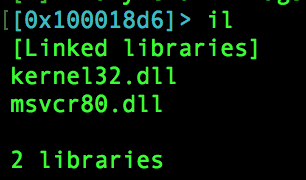
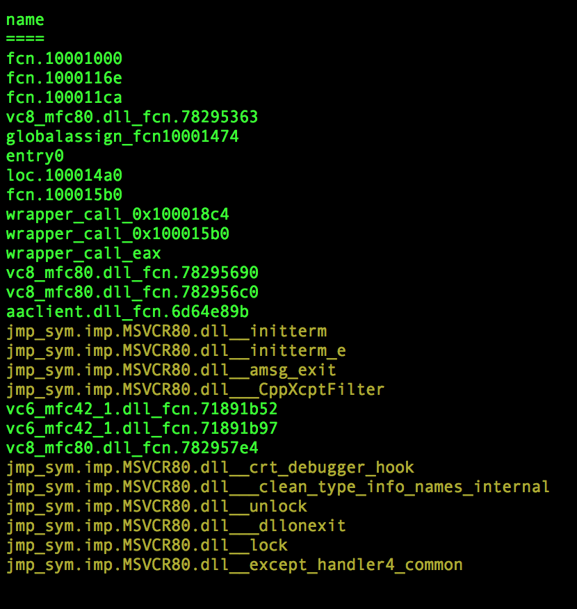
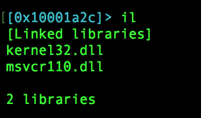
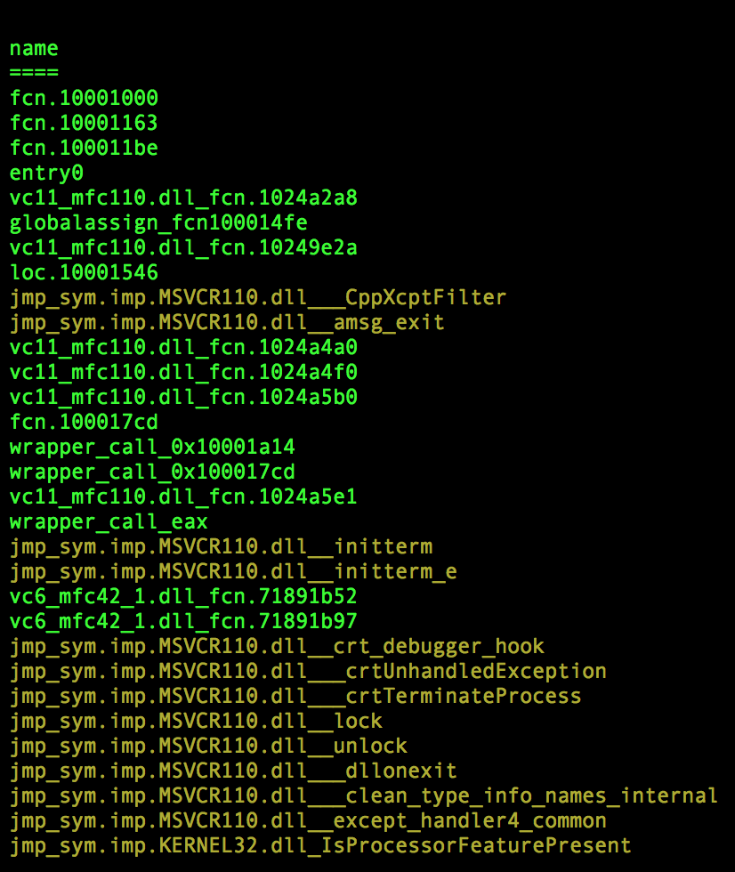

# How to use sigs.py

The sigs.py file allows a user to create signature hash files. By storing a hash instead of the signature itself, future matching operations are reduced to a set lookup. The standard signature intake for hashing is r2's native Zignatures; however, there is also an experimental function reference string set option for cross platform code such as sqlite.

## Generating New Signature Hash Files

Signature hash files can be generated from a single file or directory of similar files. If using a directory, it is best to name the directory's files in an ordered fashion. Since the sigs.py code will natively avoid collisions by only adding new values to the hash table, the code will start with the oldest file and only add new or changed functions to the final signature hashes. An example logical naming for generating signature hashes from Visual C libraries would be:

```
$ ls -1

vc6_msvcp60.dll
vc6_msvcrt.dll
vc6_oleaut32.dll
vc6_olepro32.dll
vc7_mfc70.dll
vc7_msvcp70.dll
vc7_msvcr70.dll
vc8_mfc80.dll
vc8_mfc80u.dll
vc8_msvcp80.dll
```

In the above manner, all the VC6 code will be parsed before VC7 and VC8. To actually generate the signatures, you can use the following command:

```
$ python sigs.py -g -z -i path/to/dlls/ -o vc32bit.zighashes
```

In the above example, the g flag says we are generating (as opposed to matching) and the z flag says the intake are zignatures (as opposed to string sets or another future experimental intake). The i flag is for input, which can be a single file or a directory of files and the o flag is for output. When generating signature hashes from zignatures, the output file should use a 'zighashes' extension. The output will be stored in a file in the following format:

```
$ head -n 10 vc32bit.zighashes

{
    "entry0": "7bacefd10ce26f78fedf3312ffe9f599",
    "int.786d617d": "fbacd45dee2d005bd454d0b8affedd40",
    "main": "00ae09c4d5a74f101eb215e1f15c37bd",
    "sym.ATL.DLL_AtlAdvise": "c12133152d67e1205a52516a5e0d6e6c",
    "sym.ATL.DLL_AtlAxAttachControl": "018ce4880810931895e380a2f15fd85e",
    "sym.ATL.DLL_AtlAxCreateControl": "1763ef3ccd0a865ba47c0c4765b97625",
    "sym.ATL.DLL_AtlAxCreateControlEx": "134c6f7b0e103d3f2e73e5459e03bbf8",
    "sym.ATL.DLL_AtlAxCreateDialogW": "0958e8d968ff0742efcf12ec7943fa26",
    "sym.ATL.DLL_AtlAxDialogBoxW": "5d870a99b6e1b7eec26b26ce8a4852ae",
    ...
```

Generation performance can vary. On a single file, the process is relatively quick. On a gutsy run against all the DLLs from a clean Windows XP SP3 install's System32 directory, the process took 2 hours (for 150+ files).

## Matching Signature Hashes During a Session

Matching can be done during an r2 session with the following command:

```
[0x10001a2c]> #!pipe python sigs.py -m -z -i /path/to/sigs.zighashes
```

In the above example, the m flag says we are matching. The other flags are all the same as what was used during the generation process. The o flag is not needed because matching does not generate an output. Note - matching is to be done during an r2 session to rename functions of the session's target binary.

To show an example highlighting this method's accuracy, consider two malware samples with the same functionality where one was compiled using Visual Studio 2005 and the other was compiled using 2012.

We can first view the file's linked libraries and note the linking to msvcr80.dll:



Then after matching, we can observe the statically linked code is all renamed to the same version of Microsoft Visual C:



Looking at the newer file, we can observe the linking to msvcr110.dll:



Then after matching, we can observe the statically linked code is all renamed to the newer version of Microsoft Visual C:



Since this method of generation/matching makes use of DLLs, only the DLL's exported functions will have names. The rest will be identified as library code with a generic naming structure. In many if not most cases, the generically named library functions are only called by other library functions and the named exports will be the functions called by developer-written functions.